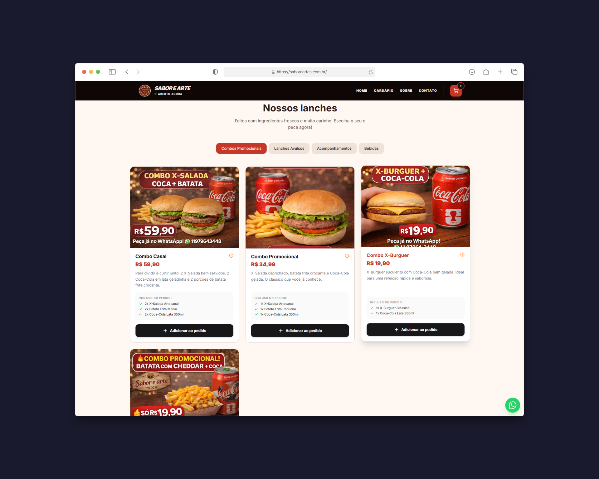
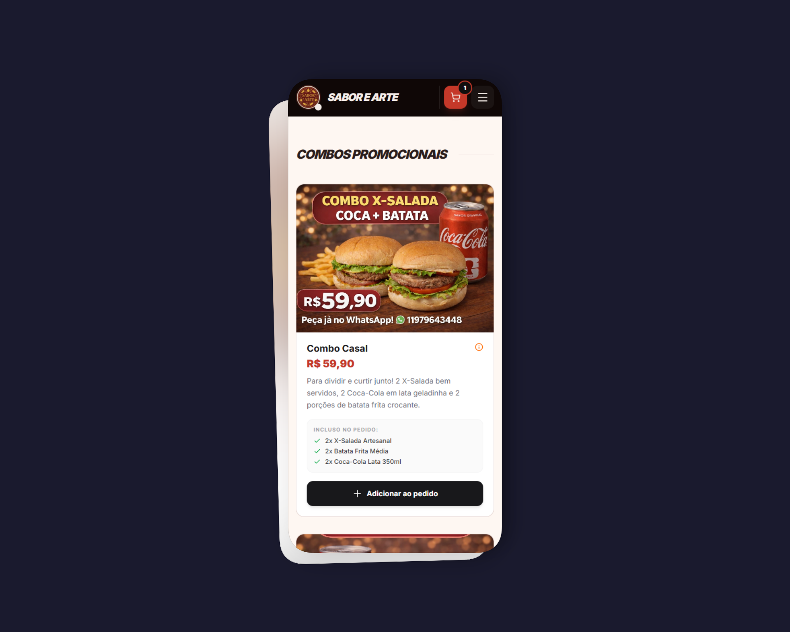

# 🍔 Sabor & Artes

[](https://github.com/Rodrigopcosta/Sabor_e_arte_hamburgueria/blob/main/LICENSE)
[](https://nextjs.org/)
[](https://www.typescriptlang.org/)
[](https://tailwindcss.com/)
[](https://currency-converter-nu-livid.vercel.app/)

**🔗 Link do Projeto:** [https://saboreartes.com.br/](https://saboreartes.com.br/)

## 📱 Preview do Projeto

### Desktop



### Mobile



## 🚀 Sobre o Projeto

Este é o sistema de cardápio digital oficial da **Sabor & Artes**, desenvolvido para proporcionar uma experiência de compra rápida, intuitiva e focada na conversão de pedidos via WhatsApp.

---

## 🛠️ Stack Tecnológica

O projeto utiliza o que há de mais moderno no ecossistema React para garantir performance e SEO:

- **Framework:** [Next.js 16](https://nextjs.org/) (App Router)
- **Biblioteca:** [React 19](https://react.dev/)
- **Estilização:** [Tailwind CSS v4](https://tailwindcss.com/) (Alta performance com variáveis OKLCH)
- **Linguagem:** TypeScript (Tipagem estrita)
- **Ícones:** Lucide React
- **Animações:** Tw-Animate-CSS
- **Qualidade de Código:** ESLint + Prettier + Tailwind Plugin

---

## 🚀 Como Executar o Projeto

Para rodar o ambiente de desenvolvimento localmente, siga os passos abaixo:

1.  **Instalar dependências:**

    ```bash
    npm install
    ```

2.  **Iniciar servidor de desenvolvimento:**

    ```bash
    npm run dev
    ```

    Acesse: `http://localhost:3000`

3.  **Gerar build de produção:**
    ```bash
    npm run build
    ```

---

## 🧹 Automação e Qualidade de Código

Este projeto está configurado para manter um padrão rigoroso de escrita. Antes de realizar qualquer commit, recomenda-se rodar o comando de correção automática:

- `npm run fix`: **(Recomendado)** Formata o código, organiza as classes do Tailwind e corrige avisos do ESLint de uma só vez.
- `npm run lint`: Verifica se há erros de boas práticas no Next.js.
- `npm run format`: Ajusta apenas a indentação e estilo visual (Prettier).

---

## 📂 Estrutura de Pastas Principal

- `/app`: Rotas e páginas (Home, Checkout, Sucesso).
- `/components`: Elementos de interface (Botões, Cards de Produto, Modais).
- `/context`: `CartContext` com gerenciamento de estado e persistência em `localStorage`.
- `/data`: Arquivo `menu-data.ts` que centraliza produtos, categorias e horários de funcionamento.
- `globals.css`: Definições de cores de marca e temas (Header/Footer fixos em modo escuro).

---

## 🔒 Licença e Propriedade Intelectual

**ESTE É UM SOFTWARE PROPRIETÁRIO.**

Todo o código-fonte, ativos gráficos e design são de propriedade exclusiva da **Sabor & Artes**.

- **Proibido:** Cópia, redistribuição ou uso comercial sem autorização.
- **Autorizado:** Manutenção técnica apenas por desenvolvedores credenciados.

---

## ✍️ Autor

**Rodrigo Costa**

- GitHub: [@Rodrigopcosta](https://github.com/Rodrigopcosta)
- LinkedIn: [in/rodrigopc-developer](https://www.linkedin.com/in/rodrigopc-developer)
- Portfolio: [rodrigopcosta.github.io](https://rodrigopcosta.github.io)
